# **Out and About**

The Out & About (OAA) app is a social platform for sharing and promoting music events locally and further afield with friends, family and other users. Whilst the app is intended for academic purposes, it is inspired by prospective user needs to connect on a smaller, organic scale and easily share events taking place that others within their social network would be interested in. A localised form of this kind of platform existed before larger players in the market created scaled offers that had greater scope than just being focused on connecting people within smaller social networks with a focus on purely promoting music or cultural events. However, the app could be scaled and is designed to accommodate high volumes of users with features that can be adapted to demand. Examples of bigger platforms might include Resident Advisor or elements within broader social media platforms, like Instagram or Facebook events.

The API includes search and filter logic to improve user experience, and make it easier for users to find events based on their interests or connections in their network.

Out and about provides an interactive platform to create, view, edit and delete event information for a users’ events. A user can upload an event, including the date, a description, a category of music genre an event poster. A user who wishes to attend events can follow event hosts, show their interest in attending an event, comment on an event and write a review for an event that they have attended in the past.  

This fictional site was created for my 5th Portfolio Project (Advanced Front End) - Diploma in Full Stack Software Development Diploma at the [Code Institute](https://www.codeinstitute.net).

[View live site here]( https://oaa-react-app-5abadda9e24d.herokuapp.com/)

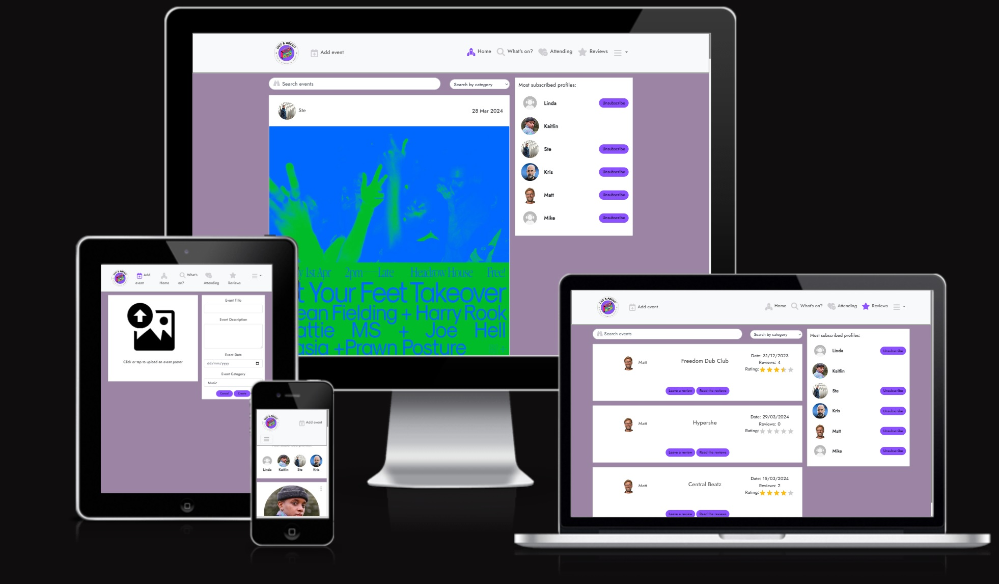

## Table of Contents

- [Project](<#project>)
    * [Objective](<#objective>)
    * [Goals of a site user](<#goals-of-a-site-user>)
    * [Project Management](<#project-management>)

- [User Experience (UX)](<#user-experience-ux>)
    * [Wireframes](<#wireframes>)
    * [User Stories](<#user-stories>)
    * [Site Structure](<#site-structure>)
    * [Design](<#design>)

- [Existing Features](#existing-features)
  * [Navigation and UX](#navigation-and-ux)
  * [Homepage](#homepage)
  * [What’s on](#whats-on)
  * [Comments](#comments)
  * [Reviews](#reviews)
  * [Profile Page](#profile-page)
  * [Contact](#contact)
  * [React Reusable Components](#react-reusable-components)

- [Future features](<#future-features>)

- [Front end technologies](<#front-end-technologies>)
  * [Languages](<#languages>)
  * [Frameworks and Software](<#frameworks-and-software>)
  * [Libraries](<#libraries>)
- [Testing](#testing)
- [Deployment](#deployment)
- [Credits](#credits)
- [Acknowledgements](#acknowledgements)

# **Project**

## Objective

The project objective is to develop a social platform to promote events within networks at a smaller scale than what is currently available. The platform allows users to view, create, edit, delete, comment and review event postings. The content can be viewed in a logical order, filtered by category, and searched for by keywords. Users can also follow each other and register their interest in other user's content. 

## Goals of a site user

Site users fall into two broad types of categories: users who only want to host event or users seeking to connect with information on events in their network. Naturally there will be a cross over between these broad categories but I had these schemas in mind when thinking about the site development.

Event owners will want to share details of upcoming and understand the interest in their events. Being able to read comments in advance of an event will help event owners understand the demand for their events whilst also organically connecting with other users who might be interested. 

Users who don’t own an event will want to understand the different kinds of events taking place, genres of music, the dates that events will be happening as well as seeing who else might be attending in their networks alongside understanding the experience after an event has taken place. 

The benefit for both event organisers and generic users is that the scale of OAA means that it is more accessible and personal than some of the bigger platforms but there is potential to scale the provision as demand and interest grows, as well as including more feature development.

## Project Management

### Github Project Board

The GitHub Kanban board was used to develop the [OAA](https://github.com/users/MattuW4/projects/6) project using Agile principles from the start. User stories were created for a developer to follow and test during the build process. Individual sprints were undertaken for the project to achieve developer user stories. The OAA API backend project tasks were also included in this Kanban board with shared epics. 

The MoSCoW method was employed for each user story to provide a level of prioritisation. Sprints were undertaken to complete dedicated tasks and make the development process more manageable for one developer.

### Database Schema

All database models are located in a separate DRF repository. It can be found [here](https://github.com/MattuW4/out-and-about-backend) and includes a README and TESTING files for reference.

# **User Experience (UX)**

## Wireframes

The wireframes for the site were created in the software [Figma]( https://www.figma.com). The site was designed with mobile first in mind but is responsive for tablet, mobile and. CI Moments walkthrough tutorial was used for the basis of the initial layout but this was developed and built out as the app evolved and to fit the project goals.

<b>Wireframes</b>

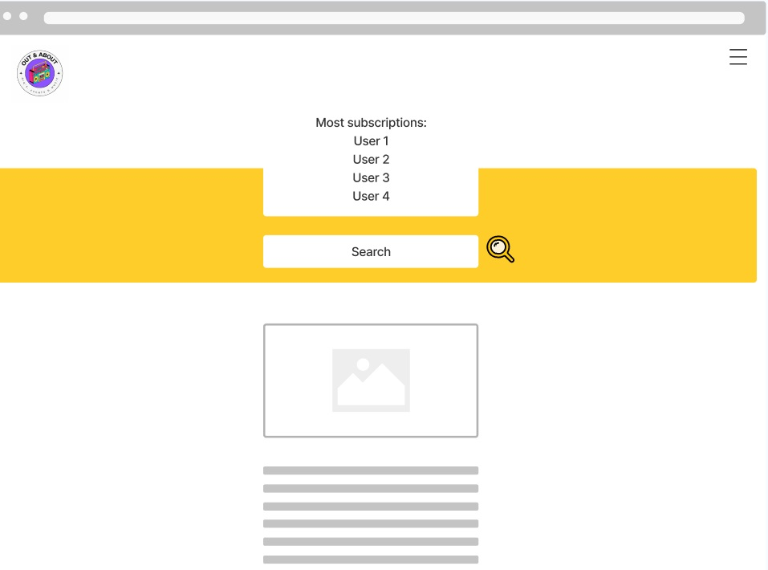
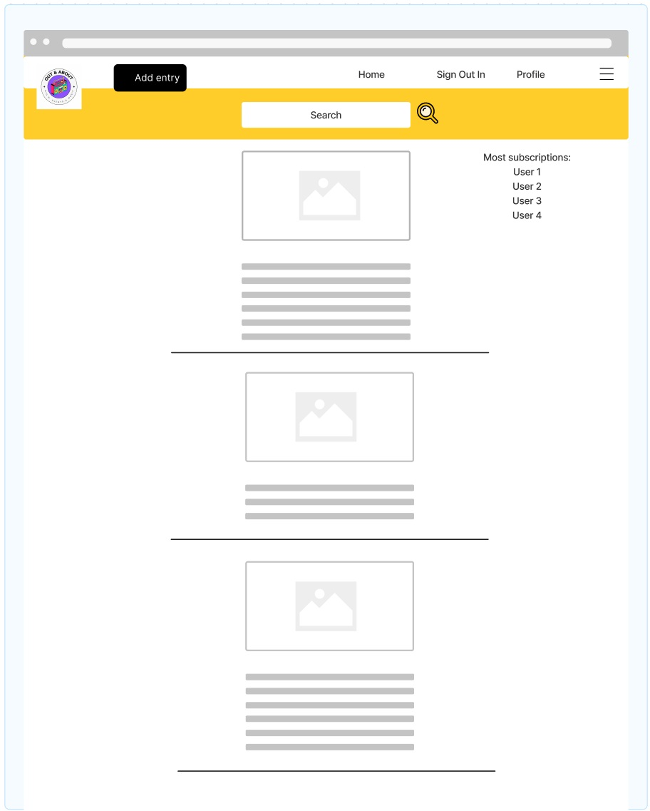
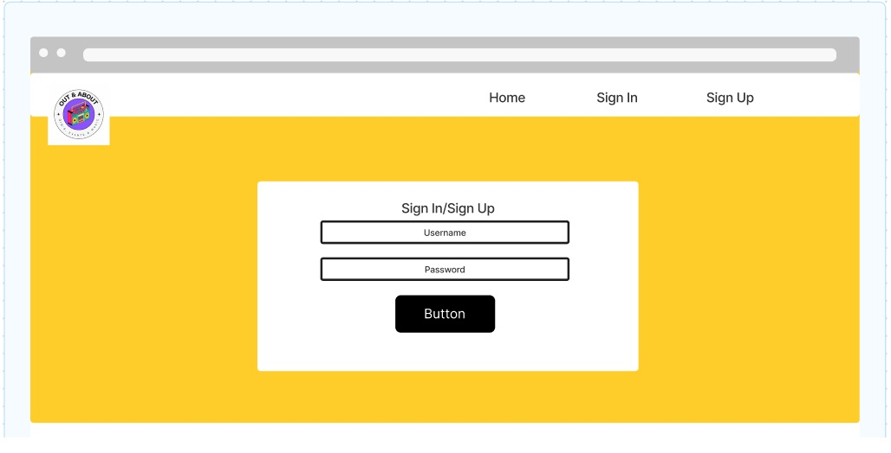
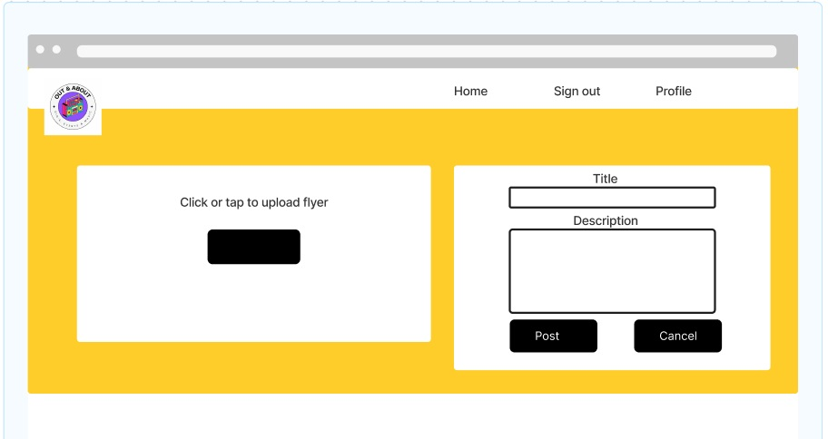

 

## User Stories

The following are the main summaries of user stories for logged in/out users and tested in a separate section. 

### Logged Out 
|  | | |
|:-------:|:--------|:--------|
| As a Logged out User | I can log in so that I can interact with the site | &check; |
| As a Logged out User | I can sign up so that I can have an account to interact with the site | &check; |
| As a Logged out User | I can see all events listed so that I can see all events shared on the site | &check; |
| As a Logged out User | I can view a single event so that I can see specific event details| &check; |
| As a Logged out User | I can view the popular profiles on the site so that I can see who has the most subscriptions and popular events | &check; |
| As a Logged out User | I can view the details of an individual profile page so that I can see profile data and be more informed about another user | &check; |
| As a Logged out User | I can filter events by category so that I can see events based on genre | &check; |
| As a Logged out User | I can search events by title and profile so that I can particular events | &check; |
| As a Logged out User | I can view comments of an event so that I can see other user’s interaction in relation to an event | &check; |

### Logged In 
|  | | |
|:-------:|:--------|:--------|
| As a Logged in User | I can log in so that I can interact with the site | &check; |
| As a Logged in User | I can log out from the site so that my profile and site information aren’t accessible | &check; |
Events
| As a Logged in User | I can see a list of all events so that I can browse events and other user’s engagement across the site | &check;
| As a Logged in User | I can view a single event so that I can see specific event details | &check; |
| As a Logged in User | I can view the What’s On page so that I can only see events from profiles I have subscribed to and keep up-to-date | &check; |
| As a Logged in User | I can view the details of an individual profile so that I can see more about that profile | &check; |
| As a Logged in User | I can see all the events from one profile so that I can keep up-to-date with that user’s events | &check; |
| As a Logged in User | I can filter events by category so that I can see events based on genre | &check; |
| As a Logged in User | I can search events by title and profile so that I can find events I want to attend | &check; |
| As a Logged in User | I can create a new event so that I can promote my event or that of another| &check; |
| As a Logged in User | I can edit events I have created so that I can update details with any changes | &check; |
| As a Logged in User | I can delete events I have created so that I can make cancellations | &check; |
Attending
| As a Logged in User | I can express interest in attending an event so that others know I am attending and I can keep track of events | &check; |
| As a Logged in User | I can remove interest in attending an event so that I can remove interest in an event if I am not attending| &check; |
Comments
| As a Logged in User | I can view comments on event so that I can see what other users think and engage with them | &check; |
| As a Logged in User | I can create a comment so that I can engage with other users and share thoughts about an even| &check; |
| As a Logged in User | I can edit comments I created so that keep them updated if information changes | &check; |
| As a Logged in User | I can delete comments I created so that I can keep this information updated | &check; |
| As a Logged in User | I can delete a comment that I created so that I can remove comments as I see fit | &check; |
Subscribe
| As a Logged in User | I can subscribe to another user so that I can see their events on my What’s On page | &check; |
| As a Logged in User | I can un subscribe from another user so that I don’t see their events on my What’s On page | &check; |
Reviews
| As a Logged in User | I can view all previous events that I have attended so that I can see their review count and average rating | &check; |
| As a Logged in User | I can view all the reviews relating for a single event so that I can see other user's experience of that event | &check; |
| As a Logged in User | I can post a review on a previous event I attended so that I can share my experience of the event with my network | &check; |
Profiles
| As a Logged in User | I can view the popular profiles on the site so that I can see who has the most subscriptions and popular events | &check; |
| As a Logged in User | I can view the details of an individual profile page so that I can see profile data and be more informed about another user | &check; |
| As a Logged in User | I can edit my profile page so that I can change information about myself and keep others updated | &check; |
| As a Logged in User | I can change my username and password so that I can securely manage my login detals | &check; |
Contact
| As a Logged in User | I can send a message to the site admin so that I can provide feedback or ask any questions about the site | &check; |

## Site Structure

The site is split into two parts: when a user is logged in or out. Depending on login authentication status different pages and page views are available to a user. When the user is logged out the pages: Home, and Sign In/Up are available from the Navigation Bar menu. When the user is logged in What’s On, , Reviews, Contacts Signout and a user’s Profile Page become available. 

## Design 

* ### Colour Scheme

I endeavoured to pick a contrasting colour scheme that would improve accessibility whilst also being clean, simple and neutral. I did not want something that would cause fatigue for users if they were on the platform for an extended period.  [Coolors]( https://coolors.co/) was used to match a colour palette based on the purple from the log that I designed.

* ### Typography

The main font used for the site is ‘Jost’ with a back up of Sans-Serif. This imported from [Google fonts[(https://fonts.google.com/).

# **Existing Features**

* ## Navigation and UX

When a user first visits the site a welcome modal is displayed containing information about the site as well as links to the sign in/up pages. A user has to navigate away from this page which encourages engagement with the ethos and identity of the page from the initial interaction.

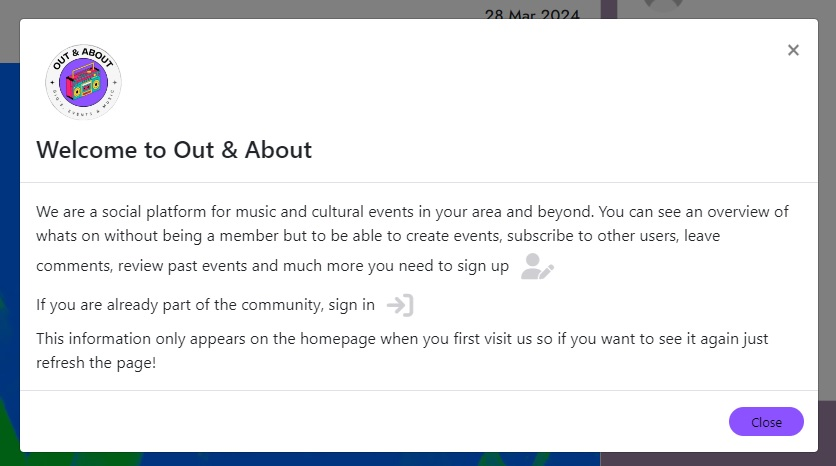

The navigation bar is present throughout the site and displays different site options dependent upon authentication. For tablet and mobile devices, the navigation bar menu turns into a hamburger dropdown list. The icons have a hover and fixed effect so that a user can interact with them and be orientated to where they are in the site when using it.

* Logo - On the far left there is a logo visible throughout the site that links to the home page
* Home – this is a link to the home page 
* Not authenticated (signed out) – the sign in and sign up links are visible to navigate to the respective pages. These pages require a user to enter details that matches (password) or is unique (usernames) and they will be prompted if this is not met. 

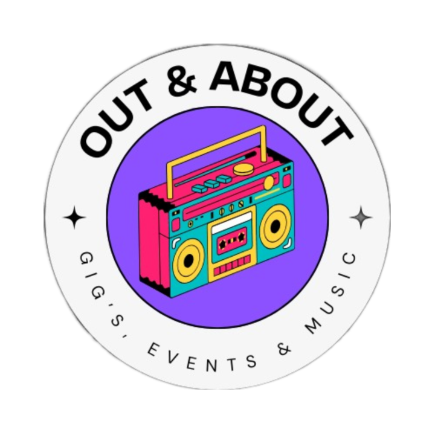

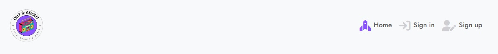

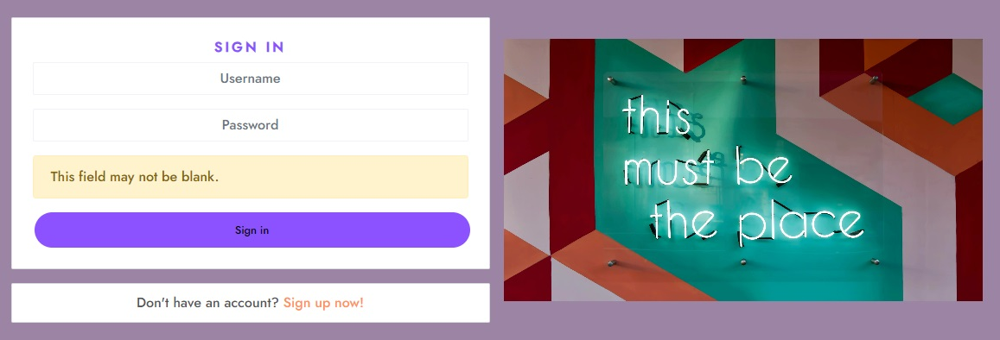

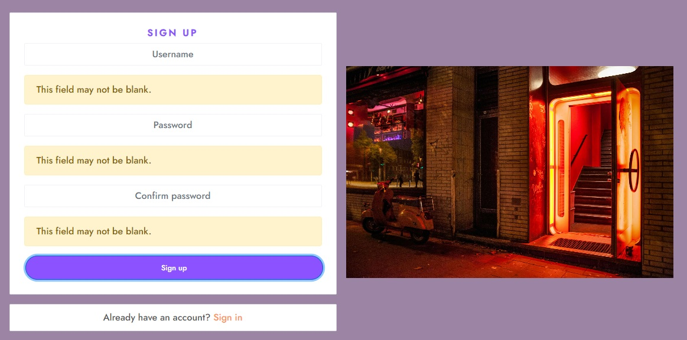

* Authenticated (signed in) – the sign in and sign up links are not visible and instead they are replaced with Add event, What’s on, Attending, Reviews and a further drop down menu that includes Profile, Contact and Sign out. 

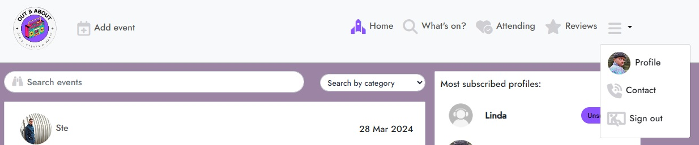

If a user tries to navigate to a page that does not exist or there is an error, then a custom 404 page is rendered.

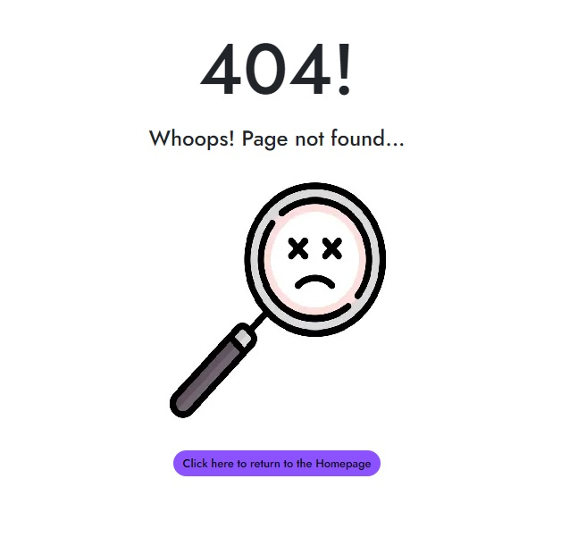

* ## Homepage

There are 3 react components that constitute the Home events page. 

1. Popular Profiles Component
2. Events posts
4. Search and Categories

### Popular Profiles Component

The popular profiles component features the top 6 profiles and is a feature across the site. On mobile only the top 4 profiles are shown.

Depending on signed in/out authentication a user will see the option to un/subscribe to a profile whilst this is removed for a logged out user.

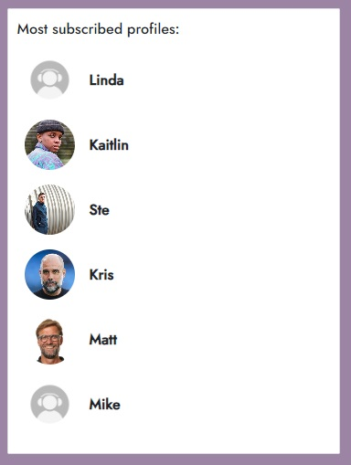

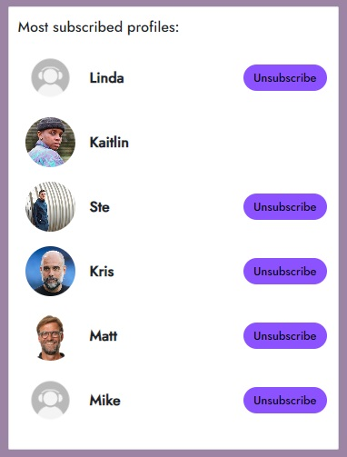

A user cannot subscribe to themselves so the un/subscribe button does not appear next to their name and avatar. Each avatar can be clicked on to navigate to the full user profile page. 

### Event & Event Details Pages

These pages contain both the individual event information (title, description, date, category, poster, attending, comments) as well as the collection of all events on the site. A user can click on the event poster or comment logo to access the specific event information.

A logged in user can indicate that they are planning to attend an event as well as withdrawing this intention. If not logged in then a user cannot indicate their intention to attend and are advised of this with a warning message.

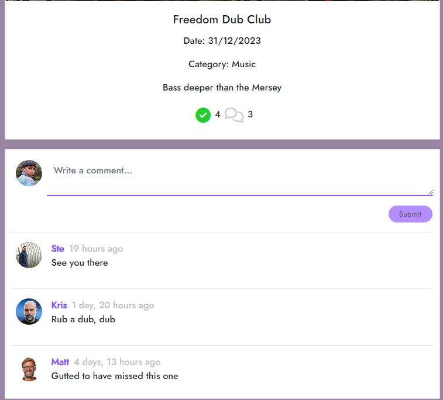

If there is no event created by a user then the following is displayed:

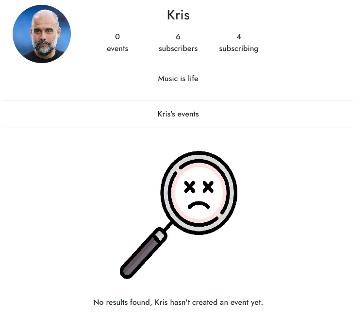

### Search and Category Filter

1. Search – A user can search all the events listed by event title and username. 

2. Categories - All events are assigned a category on creation by a user based on pre-set categories. The events list can be filtered by these categories to show only the events in one category selected by the user dropdown options. 

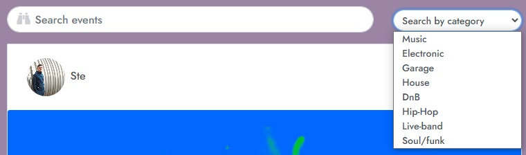

* ## What’s on

The page requires the user to be logged in. It filters events from the API based on the subscriptions made by a user to other users.

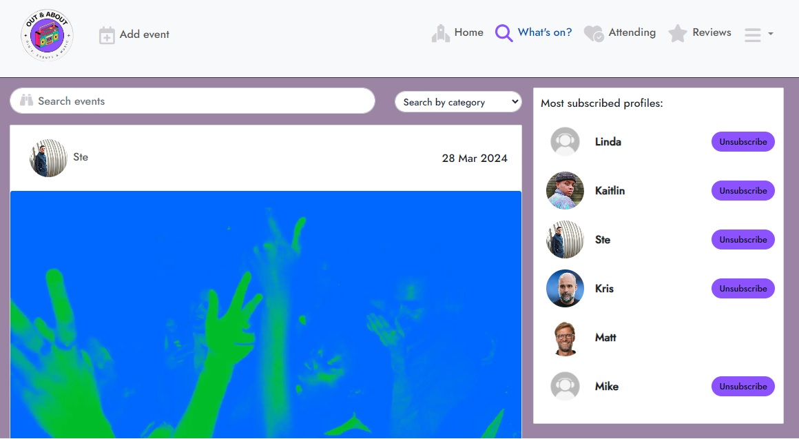

* ## Create and edit an Event

As a logged in user can create new events by clicking on the Add Event in the Nav Bar. You navigate to a New Event page where you can submit the event creation form to the API.

All fields are mandatory apart from the event description. Warnings are flagged if not. The date format is flagged as not correct (covered elsewhere in the README/TESTING docs) but one can be selected from the date picker. An event poster must be uploaded. 

Once an event is created a user who owns that event can navigate to an edit page that is prepopulated and edit the details contained within.

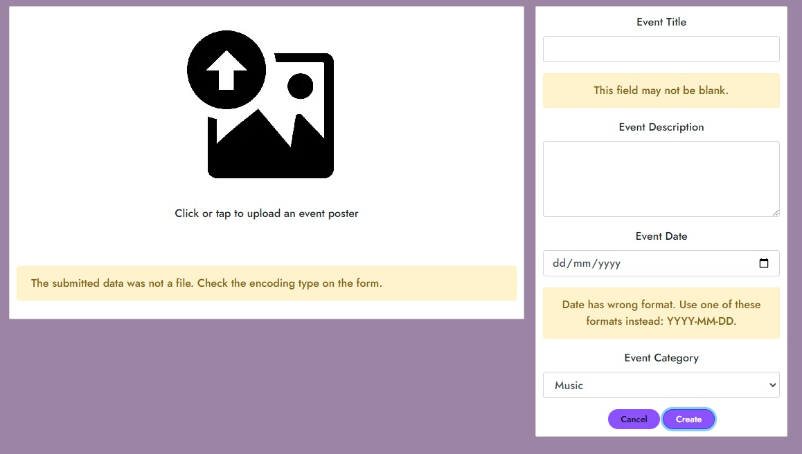

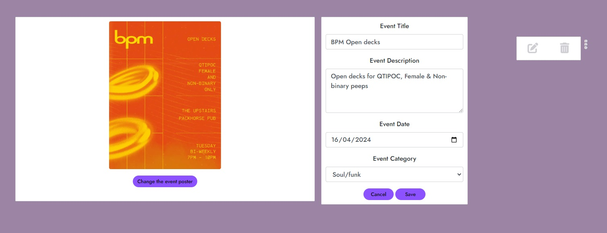

* ## Comments
A logged in user can leave a comment on an event. They can edit this comment or delete it as well. If they are not logged in then they cannot leave a comment.

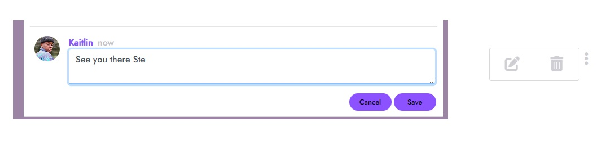

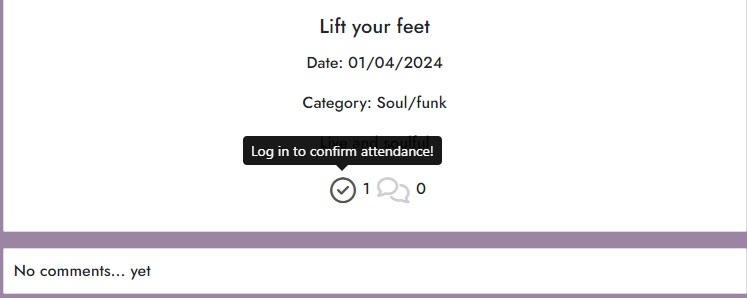

Any comments that have been posted about this event are displayed, regardless of login status. If the user logs in they will see a comment form above the existing comments where they can post their own comments about the event for other users to read. 

* ## Reviews

A logged in user can access the reviews page. This page displays past events that they have indicated they were attending. The user can navigate to a page to create a review or read other user reviews. This is different to the comment function with these being intended to be used in the run up and during an event. Reviews are retrospectives on the experience and continue the community engagement post an event. A tooltip will inform a user if they have already reviewed an event as they can only leave one review.

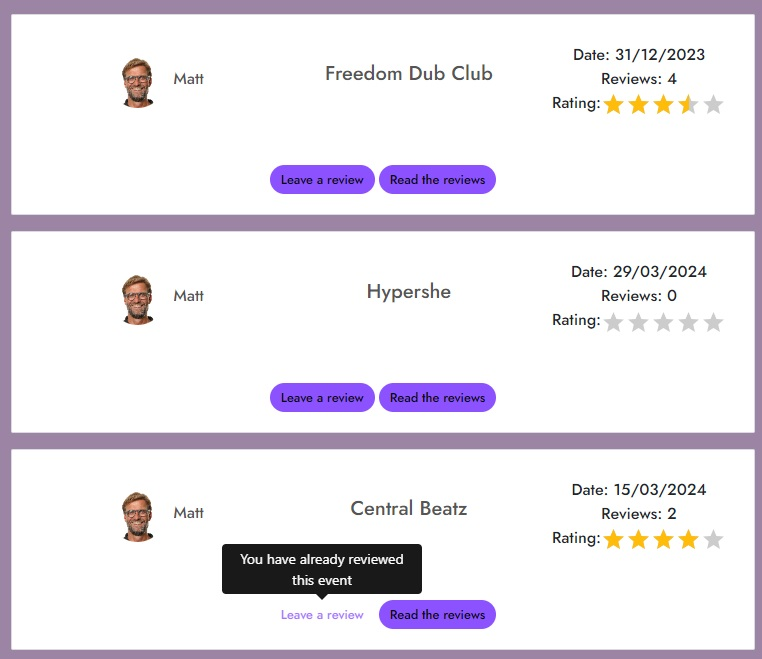

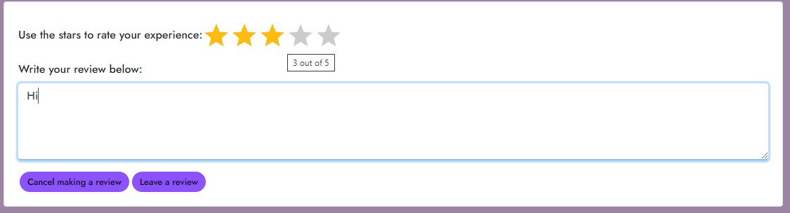

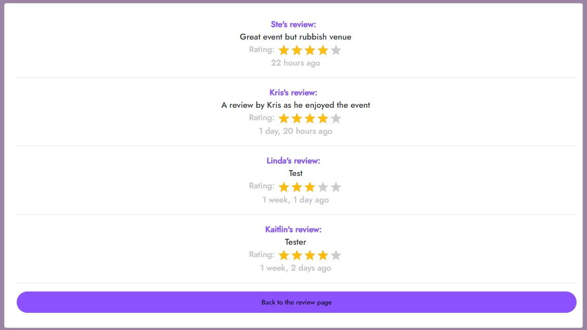

* ## Profile Page

This is a page where the user’s information is displayed. This includes stats about the number of events they have posted, how many subscriptions to other users they have and how many users are subscribed to them. There is also a place to include a bio and an avatar of the user themselves (should they choose to upload an image, otherwise this is set to the default). The avatar appears around the site. This information is available to all users but a logged in user can un/subscribe to a user from their profile and if they are the profile owner, there is an option to select the profile edit function. From here a user can edit they username, bio and password. 

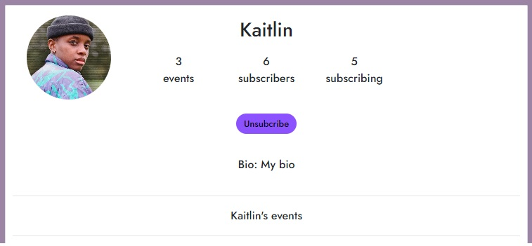

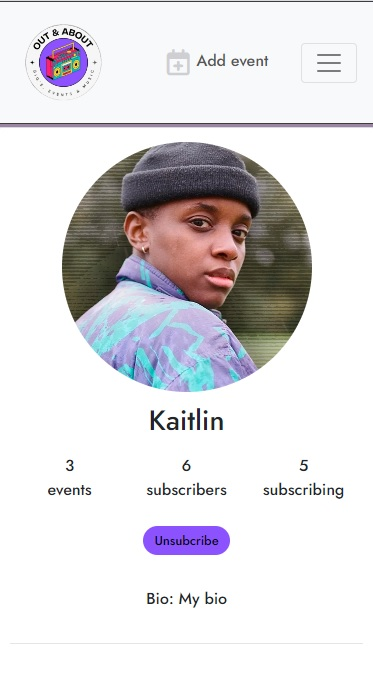

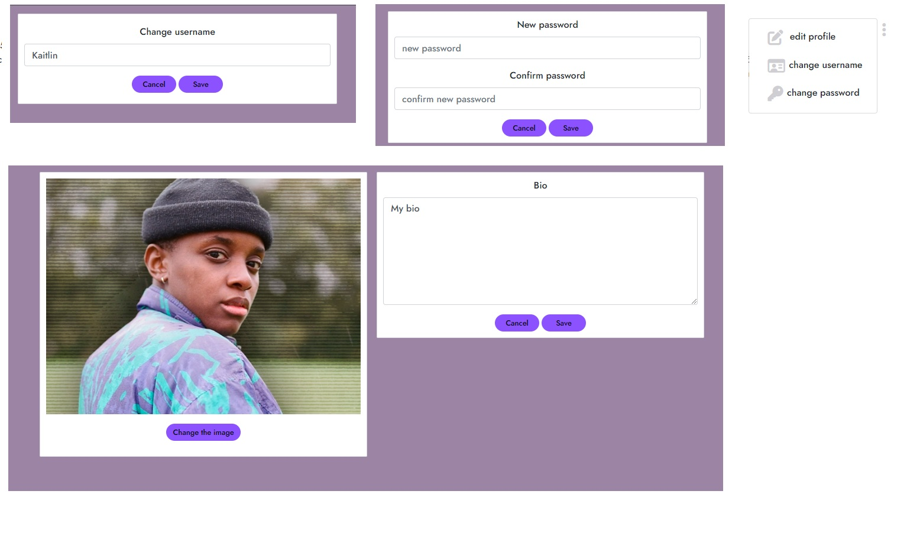

* ## Contact

A logged in user can access a contact form to send a message to the site admin to provide their feedback.

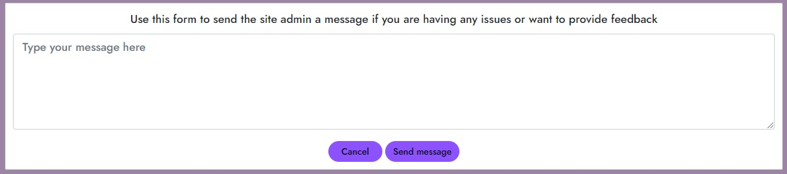

* ## React Reusable Components

### Three Dots Edit Delete Dropdown Menu

I have utilised the Moments walkthrough project 'MoreDropdown' to provide a function for editing or deleting comments, events and reviews. 

### Avatar component

This is used across the app to render a users’ profile picture.

### Asset component

The asset component is used to render a waiting image as the page loads information across the app.

### Navbar component

This component is used to render the navbar across the respective pages of the app.

### Not Found Component
This is a reusable component for the 404 page to appear across the app.

### Date Format Util Component

Consulting with tutor support and resources on slack and stack overflow I developed the reusable utility component to use JavaScript/JSX to change the date format render to a more human friendly DD-MM-YYY.

### Alert Component

This is a reusable alert component to appear across the app in response to errors raised in the JSX and from back end validation messaging.

# **Future features**

* It was noted too late in development to implement that an event owner cannot read reviews on an event that they own because the filter is set to only show events that they have attended in the past (they cannot indicate that they are attending an event that they own). This feature would be implemented in the future.
* It was noted too late in development that the category filter search has no means to reset it unless the page is refreshed or navigated away to a page that does not have the category search. A future feature would be a simple means to reset this, possibly be setting to ‘no category’.
* A feature to see which events are most popular as well as users with the most subscriptions could be implemented in the future.
* Another potential future feature would be to enable peer to peer messaging rather than a contact form only for the site admin.

# **Front end technologies**

## Languages

* [HTML5](https://en.wikipedia.org/wiki/HTML) 
* [CSS3](https://en.wikipedia.org/wiki/CSS) 
* [JavaScript](https://en.wikipedia.org/wiki/JavaScript) 
* [React.js](https://en.wikipedia.org/wiki/React_(software)) 

## Frameworks and Software
* [React Bootstrap](https://react-bootstrap.github.io/) 
* [Heroku](https://en.wikipedia.org/wiki/Heroku) 
* [Figma]( https://www.figma.com)
* [Github](https://github.com/) 
* [Lighthouse](https://developer.chrome.com/docs/lighthouse/overview/) 
* [Google Chrome DevTools](https://developer.chrome.com/docs/devtools/)
*[Wave]( https://wave.webaim.org/)
* [Responsive Design Checker](https://www.responsivedesignchecker.com/) 
* [Favicon](https://favicon.io/) 
* [Cloudinary](https://cloudinary.com/) 
* [ElephantSQL](https://www.elephantsql.com/) 
* [ColorSpace](https://mycolor.space/?hex=%23081045&sub=1) 
* [HTML Validation](https://validator.w3.org/) 
* [CSS Validation](https://jigsaw.w3.org/css-validator/) 
* [JSHint Validation](https://jshint.com/) 

## Libraries

* [NPM React-star-rating](https://www.npmjs.com/package/react-simple-star-rating) 

# Testing

Click [**_here_**](TESTING.md) to read about testing for the OAA app.

# Deployment

### Heroku deployment

1. Create new GitPod workspace and Heroku account
2. Create New App in Heroku. 
3. In 'Deploy' tab select GitHub as the 'deployment method', find repo and click 'Connect'.
4. Click 'Deploy branch' to start application build. 
5. Open app once build complete. 

### Connect API backend and React frontend

1. In the Heroku dashboard, select API settings
2. In settings add 'CLIENT_ORIGIN' Config Var and set that to the URL for the deployed React app. 
3. Add 'CLIENT_ORIGIN_DEV' Config Var and enter the URL from Gitpod dev preview link, removing the trailing slash. 
4. In frontend react Gitpod workspace install Axios library using 'npm install axios'.
5. Create 'API' folder and 'axiosDefaults' file inside.
6. import axios at the top of this file
7. Include baseURL of your deployed API project.
8. Set the content-type header to multi-part/form-data as the API will need to deal with images as well as text in it's requests.
9. Set withCredentials to True to avoid CORS issues
10. Import file into App.js 

### Forking the repository

1. Login/create [GitHub]( https://github.com/) account

2. Navigate to desired repository to clone

3.In top right click ‘Fork’

4. Adjust form fields where required then click ‘Create Fork’ 

### Cloning and local setup

To clone and set up this project you need to follow the steps below.

1. Login/create [GitHub]( https://github.com/) account and navigate to desired repository

2. Click on the 'code' menu and ensure ‘HTTPS’ selected. Click on the clipboard icon to copy the URL.

3. Using an IDE and open Git Bash to create a new project. 

4. Type 'git clone', and then paste the URL copied from GitHub. Press enter and a local clone will be created.

### Credits
* All event posters were taken from the respective events hosted on [Resident Advisor]( https://ra.co/) and the [Old Woollen]( https://oldwoollen.co.uk/home).
* Profile images were taken from google and are of public figures Jurgen Klopp, Pep Guardiola, Andy Robertson and Sherelle.
* Sign in/out royalty free images taken from [Pexels]( https://www.pexels.com/)
* I created the OAA logo and favicon on [Canva]( https://www.canva.com/)
* The default profile image was provided by Code Institute but edited to fit the aesthetic of the events site
* The placeholder image upload picture was taken from [UXWing]( https://uxwing.com/upload-image-icon/) 
* I used [Favpng]( https://favpng.com/download/H6JWe7wK) to remove the logo background
* This article was suggested to me on [Stack Overflow](https://stackoverflow.com/questions/53772417/react-how-to-filter-events-according-to-date) to create the date filter for the top upcoming events component
* Similarly, this article was suggested [reactgo.com](https://reactgo.com/react-get-current-date/) in order to create the date variable as well as this article [codedamn](https://codedamn.com/news/javascript/how-to-get-current-date-in-javascript)
* My mentor provided Gareth McGirr's to aid in implementing the react star rating system along with this documentation on the [Star Rating System](https://www.npmjs.com/package/react-simple-star-rating) 
* A fellow course alumnus provided guidance and their repository to implement the ITE date filter for the past events 

# Acknowledgements
All thanks and credit goes to my partner Kaitlin for supporting me through the journey that has been learning to develop an API and implement REACT, knowing when to be accommodating of the space I was in and providing the extra inspiration and motivation to persevere. 
This fictional site was created for my 5th Portfolio Project  (Advanced Front End Specialisation) - Diploma in Full Stack Software Development at the [Code Institute](https://www.codeinstitute.net). Particular thanks goes to Martina Terlevic for her support to develop this project. 

