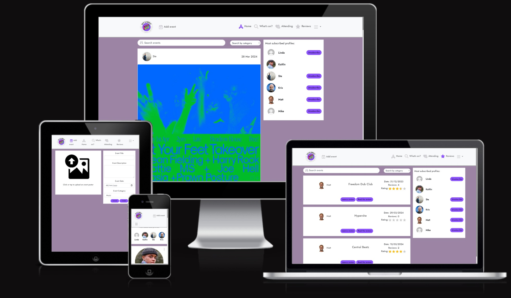

+# **Out & About Frontend Testing **

## Table of Contents

* [**Testing**](<#testing>)
    * [Code Validation](<#code-validation>)
    * [Automated Testing](<#automated-testing>)
    * [Manual Testing](<#manual-testing>)
    * [Responsiveness Testing](<#responsiveness-testing>)
    * [Lighthouse Testing](<#lighthouse-testing>)
    * [Known Bugs](<#known-bugs>)

## Code Validation 

 [W3C html Validator](https://validator.w3.org/), the [W3C CSS Validator](https://jigsaw.w3.org/css-validator/) and the [ESLint Validator](https://eslint.org/docs/latest/use/getting-started#next-steps) were used to validate the site.

### W3C HTML Validation 

When testing the deployed site the source code was selected and pasted into the HTML validator. No errors were detected with only some lines noted regarding the standard Meta code in the index.html file that could not be corrected due to the JSX syntax. 


### W3C CSS Validation Results

The URL of the deployed site was inserted into the validator. No errors were detected.


### ESLint Validation Results

On initial validation the following errors were identified:
+ errors caused by React being imported but not used so the unused instances were removed
+ in the ``` moredropdown.js ``` file the three dots component did not have a display name so ``` ThreeDots.displayName = "ThreeDots";``` was added to resolve
+ apostrophes in regular vocabulary were noted to be causing issues so a rule ``` "react/no-unescaped-entities": ["error", { "forbid": [">", "}"] }],``` was included as well as adding ``` &apos;``` in the relevant places
+ there was an error relating to children as props which was resolved by including the rules ``` "react/prop-types": [0, { "ignore": ["children"] }], "react/no-children-prop": [```
+ empty catch statements in try-catch blocks were noted (where console.log(err) had previously been. After consulting documentation the solution to include ```continue regardless of error``` has been included to fix as advised [here](https://eslint.org/docs/latest/rules/no-empty)


+ there was a missing props validation error fixed by including ```"react/prop-types": [0]```
+ the final error identified that has not been resolved at the time of writing relates to the React Dom Render being deprecated and replaced by [createRoot](https://dev.to/abhishek_159/reactdomrender-is-no-longer-supported-in-react-18-1kac#). There were no functional issues detected with the site as a result of this known error and the fix was not implemented due to time constraints


## Automated Testing

The following automatic tests have been written using Jest to check that the main frontend components render correctly: 

### NavBar.js
|  | | |
|:-------:|:--------|:--------|
| Renders NavBar Sign in link| &check; |
| Renders link to the what’s on page if user logged in | &check; |
| Renders link to the reviews page if user logged in | &check; |

## Manual Testing

The following manual tests were completed:

| Status | **Authentication - User Logged Out**
|:-------:|:--------|
| &check; | If a user types 'https://oaa-react-app-5abadda9e24d.herokuapp.com/attending' URL into the browser, the user cannot access the attending page and redirected to home page
| &check; | If a user types 'https://oaa-react-app-5abadda9e24d.herokuapp.com/reviews’ URL into the browser the user cannot access the reviews page and redirected to home page
| &check; | If a user types 'https://oaa-react-app-5abadda9e24d.herokuapp.com/events/create' URL into the browser the user is redirected back to the homepage
| &check; | If a user types 'https://oaa-react-app-5abadda9e24d.herokuapp.com/profiles/{id}/edit' URL into the browser the user cannot access the page and redirected to home page
| &check; | If a user types 'https://oaa-react-app-5abadda9e24d.herokuapp.com/events/{id}/edit' URL into the browser the user cannot access the page and redirected to home page
| &check; | Image present next to sign in form for tablet and desktop users
| &check; | Image not present next to sign in form for tablet and desktop users
| &check; | Image present next to sign up form for tablet and desktop users
| &check; | Image not present next to sign up form for mobile users

| Status | **Navigation - User Logged Out**
|:-------:|:--------|
| &check; | Navbar logo links to homepage
| &check; | Sign in button links to sign in page
| &check; | Sign up button links to sign up page
| &check; | Profile page button is not accessible to user
| &check; | Sign out button is not accessible to user
| &check; | Attending button is not accessible to user
| &check; | Reviews button is not accessible to user
| &check; | Contact button is not accessible to user
| &check; | Event add button is not accessible to user
| &check; | Mobile and tablet users can access a burger toggle menu
| &check; | Clicking a link from the navigation bar links automatically closes the burger menu when not in the sub menu
| &check; | User cannot use false details to sign in otherwise warning displayed
| &check; | User needs to complete input fields to sign in otherwise warning displayed
| &check; | User has to complete all fields to sign up otherwise warning displayed
| &check; | Both password fields have to match to sign up otherwise warning displayed
| &check; | Username has to be original to sign up otherwise warning displayed

| Status | **Homepage - User Logged Out**
|:-------:|:--------|
| &check; | Users can view Popular Profiles 
| &check; | Subscribe button not visible on profile page
| &check; | Profile avatar links to profile page
| &check; | Popular profiles component viewable on the right for desktop and tablet users
| &check; | Popular profiles component viewable on the right for mobile users
| &check; | Users can view title, description, event date, image on all events 
| &check; | Attending count is viewable by user
| &check; | Comments count is viewable by user
| &check; | Clicking an event poster takes user to event detail page
| &check; | Clicking comments count takes user to event detail page
| &check; | Clicking an avatar takes user to event detail page
| &check; | Users can search for events using title and other user name
| &check; | Users can use the category dropdown to filter events

| Status | **Event Detail Page - User Logged Out**
|:-------:|:--------|
| &check; | Popular Profiles component is viewable
| &check; | Clicking an avatar takes user to the selected profile page
| &check; | Single event details are viewable
| &check; | Clicking the attending button, users are advised to log in to register their interest in the event
| &check; | Published comments are viewable by a user
| &check; | Create comment form is not accessible

| Status | **Profile Page - User Logged Out**
|:-------:|:--------|
| &check; | Popular Profiles component is viewable
| &check; | Clicking an avatar takes user to the selected profile page
| &check; | Users can view the number of events the profile owner has posted
| &check; | Users can view the number of subscriber the profile has
| &check; | Users can view the number of other profiles the profile is subscribing to
| &check; | Users can view events which were posted by the selected profile
| &check; | Clicking an event poster takes user to event detail page
| &check; | Clicking the attending button, users are advised to log in to register their interest in the event
| &check; | Clicking events comment count redirects users to the selected event detail page

| Status | **Navigation - User Logged in**
|:-------:|:--------|
| &check; | Navbar logo loads homepage
| &check; | Sign in button not accessible
| &check; | Sign up button not accessible
| &check; | Profile page accessible in drop down menu
| &check; | Contact page accessible in drop down menu
| &check; | Sign out page accessible in drop down menu
| &check; | What’s on page accessible in navbar
| &check; | Reviews page accessible in navbar
| &check; | Add event page accessible in nav bar
| &check; | Tablet and mobile users can access the navigation bar options in a burger menu dropdown
| &check; | Clicking a link from the navigation bar links closes the burger menu
| &check; | User can view their avatar image next to profile page link

| Status | **Homepage - User Logged in**
|:-------:|:--------|
| &check; | Popular Profiles component is viewable
| &check; | Clicking an avatar takes user to the selected profile page
| &check; | Subscribe button available next to each profile in top subscribers
| &check; | Users can subscribe to popular profiles by clicking the subscribe button
| &check; | Users can unsubscribe to popular profiles by clicking the unsubscribe button
| &check; | Users can view all events posted to the site 
| &check; | Attending count viewable
| &check; | Comment count viewable
| &check; | Clicking event image redirects user to relevant page
| &check; | Clicking on the attending button the attending count goes up and down on a toggle
| &check; | Logged in user who is event owner cannot attend their own event with tooltip warning
| &check; | Events comment count redirects user to event detail page
| &check; | Clicking an avatar takes user to the selected profile page
| &check; | Users can search for events using title and other user name
| &check; | Users can use the category dropdown to filter events

| Status | **Add Event Page - User Logged in**
|:-------:|:--------|
| &check; | Users can access empty form to create event
| &check; | Users can upload a poster as an image to the form
| &check; | Users can change the poster as an image in the form 
| &check; | Users are required to upload a poster as an image to submit form otherwise warning message displayed
| &check; | Users required to fill out the event title field to submit form otherwise warning message displayed
| &check; | Event date required to submit form otherwise warning message displayed
| &check; | Category required to submit form otherwise warning message displayed

| Status | **What’s on - User Logged in**
|:-------:|:--------|
| &check; | Popular profile component viewable by users
| &check; | Profile avatar links to profile page
| &check; | Subscribe button viewable in profile info
| &check; | Clicking subscribe button allows user to subscribe to other user
| &check; | Clicking unsubscribe button allows user to unsubscribe to other user
| &check; | Users can view all events posted by profiles they subscribe to 
| &check; | Clicking the comment count button redirects the user to the relevant event page detail
| &check; | Attending count is viewable
| &check; | Comments count is viewable
| &check; | Not found message and image displayed if no events posted or user not subscribed to other users
| &check; | Clicking event image redirects to the event detail page
| &check; | Logged in user cannot click attending event button if own event
| &check; | Clicking on the attending button causes the attending count up and down on a toggle
| &check; | If the logged in user is the event owner, user cannot click the attending button with a tooltip warning to prompt
| &check; | If the user clicks attending, having not previously clicked attending, the attending count goes up
| &check; | If the user clicks attending, having previously clicked attending, the attending count goes down
| &check; | Clicking avatar of event comments redirects to the events detail page
| &check; | Clicking avatar of event owner redirects to the selected profile page
| &check; | Users can search for an event using the search bar by event title and username of the event owner
| &check; | Users can use the category dropdown to filter events

| Status | **Event Detail Page - User Logged in**
|:-------:|:--------|
| &check; | Popular profile component viewable by users
| &check; | Profile avatar links to profile page
| &check; | Single event details are viewable
| &check; | Attending count is viewable
| &check; | Comments count is viewable
| &check; | Clicking on the attending button the attending count goes up and down on a toggle
| &check; | If the logged in user is the event owner, user cannot click the attending button - tooltip warning given
| &check; | Published comments on an event are viewable by user
| &check; | Comment create form is accessible
| &check; | Users can enter data into comment form and submit
| &check; | Submitting a comment increases the count by 1
| &check; | If the logged in user is the owner of a published comment, they can see the three dots edit/delete menu next to it
| &check; | Three dot menu allows user to edit or delete a comment
| &check; | Deleting a comment decreases the comment count by 1
| &check; | If the logged in user is the owner of the event they can see the three dot edit/delete menu 
| &check; |Logged in user can edit or delete own events via the three dots edit/delete menu
| &check; | Clicking edit event redirects the user to the edit events page

| Status | **Edit Event Page - User Logged in**
|:-------:|:--------|
| &check; | Pre-populated form is viewable by user to edit
| &check; | Image of poster can be uploaded to form
| &check; | Poster image can be changed in the form
| &check; | Image required to submit the form with warning
| &check; | Event title field required to submit the form with warning
| &check; | Event date field required to submit the form with warning

| Status | **Contacts - User Logged in**
|:-------:|:--------|
| &check; | User can see the create contact form
| &check; | User can input data into the create contact form
| &check; | User can submit the create contact form
| &check; | User is redirected to previous page on contact form submission

| Status | **Reviews - User Logged in**
|:-------:|:--------|
| &check; | Popular Profiles component viewable by user
| &check; | Profile avatar links to profile page
| &check; | Subscribe button viewable in profile info
| &check; | Clicking subscribe button allows user to subscribe to other user
| &check; | Clicking unsubscribe button allows user to unsubscribe to other user
| &check; | All events with date same today’s date or less are viewable by a user if they have indicated that they are attending
| &check; | Clicking an event title redirects a user to the selected event detail page
| &check; | Clicking on event owner avatar redirects the user to the selected profile page
| &check; | Users can search for events using title and other user name
| &check; | Users can use the category dropdown to filter events
| &check; | Clicking on the ‘Leave a Review' button will open the review create page
| &check; | If a user has already reviewed an event a tool tip advises that they can’t review it again
| &check; | Users receive a warning message if they try to submit a review without any comments
| &check; | Review count increases by 1 on submission
| &cross; | Average rating is recalculated on submission
| &check; | Users can read reviews left by other users on events they have attended

| Status | **Profile Page - User Logged in**
|:-------:|:--------|
| &check; | Popular Profiles component viewable by user
| &check; | Profile avatar links to profile page
| &check; | Number events posted by profile viewable
| &check; | Number of subscribers the selected profile has viewable by user
| &check; | Users can view the number of other profiles the selected profile is subscribing to
| &check; | Events posted by selected profile viewable
| &check; | Clicking the event image redirects a user to the selected event detail page
| &check; | Clicking on the attending button the attending count goes up and down on a toggle
| &check; | If the logged in user is the event owner, user cannot click the attending button - tooltip warning given
| &check; | Clicking the comment count button redirects the user to the relevant event page detail
| &check; | When viewing their own page the three dot edit/delete menu is viewable by a user
| &check; | Three dots edit/delete menu allows users to edit/delete their profile page
| &check; | Clicking edit profile redirects a user to the edit profile page
| &check; | A user’s username is editable via the three dots edit profile menu
| &check; | A user’s password is editable via the three dots edit profile menu

| Status | **Edit Profile Page - User Logged in**
|:-------:|:--------|
| &check; | Users can view the profile form pre-populated with their profile details
| &check; | Users can upload an avatar image 
| &check; | Users can update the uploaded image

## Responsiveness Testing

Responsive design was at the core of the development. A mobile first approach was utilised in order to ensure device compatibility range from smaller to larger screen sizes.

During the testing process I referred to [Responsive Design Checker](https://www.responsivedesignchecker.com/) to test the site, as well as a range of other physical devices. Am I Responsive was also used to test the formatting of the site.



### Browser Compatibility 

The app was tested on the following browsers:

- Google Chrome
- Microsoft Edge
- Mozilla Firefox
- Safari (mobile)

On safari it was noted that there was one instance where the homepage reloaded and had an unintended margin to the right of the screen where the page scroll bar overlay appears but this could not be replicated to explore further. There were no other issues with other browsers noted during testing.

## Lighthouse Testing

Google Lighthouse in Chrome Developer Tools was used to test the application. The testing showed the following:


The best practices were noted to be lower in comparison to when tested using the chrome plug in


It was noted that in the dev tools test that the blocked third party cookies were identified as an issue. It is understood that this is something being introduced for chrome recently. Further to this, a 401 error is raised which is understood to be as a result of lighthouse trying to access restricted pages in the API without authorisation. It was also noted that the ‘role=”dialog” in the modal element was triggering an inaccessible error name. Aria-labelby was added but the issue persisted. Wave was also used to explore the accessibility but this was not an issue identified in that platform. Wave identified missing name tags that had not been created or were inaccessible so aria-labels were added. The contrast of the buttons was also improved across the app. An approach to improve performance was attempted by implementing a file conversion on the field model in the API but this caused further issues and so the approach was reverted. 

### Peer/user Review

Real world users were also asked to interact with the app. Their feedback was used to inform development, particularly when thinking about colour schemes. Positive feedback was received on the end product.

## Known Bugs

### Resolved

1. Known issue with the React Bootstrap mobile Navbar.Collapse burger menu that when an item is selected, it doesn't automatically close. Used fix in CI Moments walkthrough. This does not handle additional dropdown menus within the burger menu though. On mobile the links within the additional dropdown couldn’t be accessed. 

Solved: Applied the set expanded toggle so that the dropdown will open and remains open until the user clicks elsewhere on the page. Does not close if the click is in the menu but a user would intuitively recognise this and navigate away from the menu with no difficulty (tested with real world users without prompts)

2. Es lint issues covered earlier in the Testing.md with solutions set out.

3. Date format was rendered as YYYY-MM-DD as this is the react standard.

Solution: Implemented a date formatter utility component that converted the date for render to DD-MM-YYYY

4. When trying to create reviews per event ID all reviews for every event were being called.

Solution: I was calling plural events and not singular events in the react code that did not match the database fields so when adjusted this resolved the problem. 

5. The star rating system was not updating, despite the star rating being rendered.

Solution: Average_rating field needed to be added to the serializer which resolved the problem. 

6. I was unable to only show events that had a past date, instead displaying all events when a user wanted to write a review.

Solution: A solution could not be found when searching on google but a fellow peer provided a fix via slack. I needed to include ```'event_date': ['lte'],``` as a filterset field on the event model and include ```const { data } = await axiosReq.get(`/events/${filter}&search=${search}&category=${category}&event_date__lte=${date}`);``` in the useEffect call to the API which enabled only dates equal to or less than today’s date to be called.

7. During testing of the navbar the tests would fail as there were no ‘name’ labels assigned to the elements.

Solution: Consulted tutor support who advised that there wasn’t an apparent reason why the name labels had not been assigned. Documentation suggested assigning aria-labels where required and with this done the tests would pass.

8. Active Class Name cannot be applied to links so the app was not rendering.

Solution: change links to Nav.links in order to enable react to recognise the prop on the DOM element and the app render.

### Unresolved
1. Eslint React Dom deprecation 


Covered in Es lint earlier in the testing.md.

2. Having implemented the date formatter utility when creating or editing an event the form would flag that the date was in the incorrect format for react i.e. not YYYY-MM-DD. 

Solution: This error being flagged by the overlay tool has been left as a user can still use the default data picker to select their preferred date and there is no issue writing or calling this information from the database. A complete fix will be pursued in future when there is more time to improve the user experience.


3. Attempted to add trigger overlay to the comment function taken from the Moments walkthrough if a comment field was left blank but this had no effect. Felt not to be problematic and could be left in the final app as it was obvious to a user that no comment was being written without text content. 

4. If the app is hard refreshed then the information modal briefly appears. A solution was not implemented to resolve this as it does not happen frequently or severely enough to be problematic to performance or for user experience but with more time this will be addressed fully in the future to prevent from occuring.

5. In a desktop view when the drop down menu that includes profile, contact and sign out links opens the whole NavBar briefly expands for a very brief moment before formatting correctly. I could not work out what was causing this or a solution but the impact was not felt to cause disruption to the user experience or impact performance so has been left in with the intention to resolve in the future with more time available.

6. As mentioned elsewhere in the Testing.md, google chrome is introducing a block on third part cookies which is logged in the console. There doesn’t appear to be any impact on the app but a solution was not identified and I did not have the time to implement but will do so in future.


Please click [**_here_**](README.md) to return to the Out & About README file.
